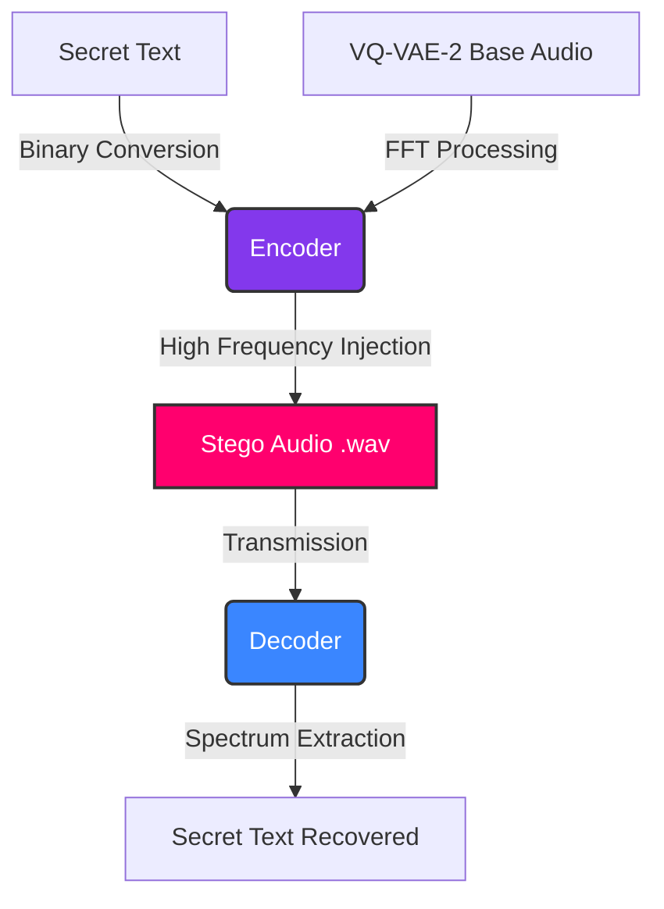

# Coverless Audio Steganography using VQ-VAE-2

[](https://www.python.org/downloads/)
[](https://flask.palletsprojects.com/)
[](https://opensource.org/licenses/MIT)
[](https://www.jetir.org/view?paper=JETIR2503535)

> **Research Publication:** This repository is the practical implementation of the research paper: [*Coverless Audio Steganography* (JETIR2503535)](https://www.jetir.org/view?paper=JETIR2503535). 

## Abstract

Normal audio steganography algorithms hide secret data inside existing audio files (like in the LSB or noise floor). However, this leaves a trace that can be detected by modern tools. 

This project uses a **Coverless Audio Steganography** approach. Instead of changing an existing file, the system creates the audio from scratch and hides the secret message inside it during the generation process. Because the secret data is built into the mathematical structure of the audio itself, it avoids footprint-based detection completely.

## Important Note on the User Interface (v2.0)

If you are reviewing this repository alongside the original publication, please note that the web interface has been completely redesigned since the paper was published. 
The original research utilized a standard graphical layout, whereas this updated repository features a newly upgraded **Terminal-style Command-Line Aesthetic**. The core VQ-VAE-2 synthesis and embedding algorithms remain identical to the published research; only the visual frontend has been enhanced to provide a more immersive experience.

## The VQ-VAE-2 Model

The core of this research is based on the **VQ-VAE-2** (Vector Quantized Variational Autoencoder 2) architecture. 
- **What it does:** VQ-VAE-2 is a deep learning model that compresses audio into discrete representations (vectors) and then reconstructs it. It generates high-quality audio by learning the hidden patterns in sound.
- **How we use it:** In our project, VQ-VAE-2 is used to synthesize the cover audio (like lo-fi beats and instruments) dynamically. By controlling the generation process, we can securely embed secret messages into specific frequency bands (like 17kHz to 19kHz). The generated audio sounds natural to the human ear, but the hidden data can be extracted safely by the receiver.

## Research Areas & Domains

This project sits at the cutting-edge intersection of multiple computer science disciplines, specifically **implementing Generative AI (GenAI) for Applied Cryptography**. It practically bridges the gap between deep learning synthesis and secure communications, covering the following core domains:

1. **Applied Cryptography & Steganography:** Securing ciphertext by mathematically embedding it into structural signals rather than appending it to existing data.
2. **Generative AI (GenAI):** Using generative architectures (like VQ-VAE-2) to dynamically synthesize the audio carrier (music, lo-fi beats) from scratch.
3. **Digital Signal Processing (DSP):** Utilizing Fast Fourier Transforms (FFT) and precise frequency modulation to manipulate and read audio spectrums at the 17kHz-19kHz ranges.
4. **Information Security:** Creating footprint-free, undetectable communication channels that are highly resistant to modern steganalysis.

## Project Architecture

### Visual Flow



## Core Features

- **Coverless Paradigm**: No existing files are modified. The audio is generated entirely from scratch to act as the carrier.
- **Spectrum Embedding**: The text message is converted to binary and mapped to high frequencies that are masked by normal musical sounds.
- **Secure Web Terminal**: A simple, terminal-style web application built with Flask for encoding and decoding audio.

## Technical Stack

- **Deep Learning / Audio Generation**: VQ-VAE-2 framework
- **Signal Processing**: `numpy`, `scipy`, `pydub`, `soundfile`
- **Web Infrastructure**: Python `Flask`, Jinja2, Vanilla JS/CSS

## Installation & Usage

### Prerequisites
Make sure you have `Python 3.11+` and `git` installed on your system.

### Local Setup

1. **Clone the repository:**
   ```bash
   git clone https://github.com/rakesh-pathuri/Coverless-Audio-steganography-using-VQ-VAE-2.git
   cd Coverless-Audio-steganography-using-VQ-VAE-2
   ```

2. **Create a Virtual Environment:**
   ```bash
   python -m venv .venv
   
   # Windows
   .\.venv\Scripts\activate
   # macOS/Linux
   source .venv/bin/activate
   ```

3. **Install Dependencies:**
   ```bash
   pip install -r requirements.txt
   ```

4. **Run the Application:**
   ```bash
   python main.py
   ```

5. **Login and Test:**
   Open `http://localhost:5000` in your web browser. Login using the default credentials:
   - **Username**: `operator`
   - **Password**: `terminal123`

## Decoding Process

When the receiver gets the generated `.wav` file, the decoder processes the audio using FFT (Fast Fourier Transform). It isolates the high-frequency bands, reads the binary data, and converts it back into the original text message.

---
### Authorship & Contributions

**Lead Developer & Primary Author:** Rakesh Pathuri

*While the underlying research was published as a collaborative group project, the entirety of the software architecture, the audio synthesis engine, and the web infrastructure within this repository were independently designed and built by Rakesh Pathuri.*
